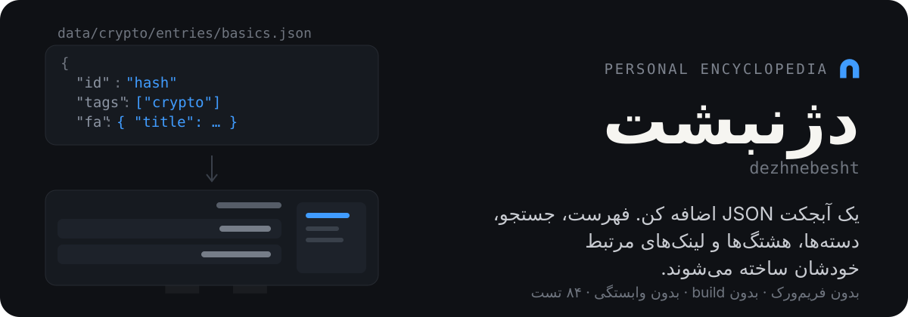
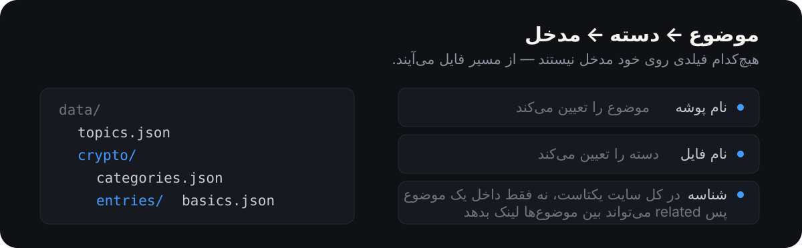

<p align="center">
  
</p>

<p align="center">
  <a href="https://serajian.github.io/dezhnebesht/"><b>سایت زنده</b></a>
  &nbsp;·&nbsp;
  <a href="https://serajian.github.io/dezhnebesht/#/t/blockchain">یک مدخل نمونه</a>
  &nbsp;·&nbsp;
  <a href="https://serajian.github.io/dezhnebesht/#/self-test">خودآزمایی</a>
</p>

---

<div dir="rtl">

چیزی می‌خوانی، به زبان خودت توضیحش می‌دهی، و یک مدخل می‌شود. کاری که این پروژه می‌کند این است که **بقیه‌اش را خودش بسازد**: فهرست، جستجوی زنده، دسته‌بندی، فیلتر هشتگ و لینک‌های میان مدخل‌ها، همه در زمان لود از خود داده ساخته می‌شوند.

دوزبانه است (فارسی/انگلیسی) و روی GitHub Pages منتشر می‌شود. نام از `diz ī nibišt` پهلوی می‌آید — «دژِ نوشته‌ها»، آرشیوی که در روایت ساسانی نسخه‌ای از اوستا در آن نگهداری می‌شد.

</div>

> **English** — A personal, dependency-free bilingual encyclopedia. Add a JSON object to a category file and the index, live search, categories, hashtag filters and cross-links all derive themselves. No framework, no npm, no build step; the site is plain ES modules served straight from GitHub Pages.

<div dir="rtl">

## افزودن یک مدخل

فایل دستهٔ مربوطه را در `data/<موضوع>/entries/` باز کن و یک آبجکت اضافه کن:

```json
{
  "id": "proof-of-work",
  "tags": ["mining", "consensus"],
  "related": ["hash", "nonce"],
  "fa": { "title": "اثبات کار", "short": "…", "body": "<p>…</p>" },
  "en": { "title": "Proof of Work", "short": "…", "body": "<p>…</p>" }
}
```

فقط `fa` اجباری است. `en` و `example` و `svg` و `related` اختیاری‌اند. مدخلی که ترجمهٔ انگلیسی ندارد در حالت انگلیسی با متن فارسی و نشان «ترجمه نشده» نمایش داده می‌شود، نه صفحهٔ خالی.

**هیچ فایل JS‌ای دست نمی‌خورد.** همین قاعده شکل کل پروژه را تعیین کرده.

<p align="center">
  
</p>

**دستهٔ تازه:** فایل جدیدی در `data/<موضوع>/entries/` بساز و یک سطر به `categories.json` همان موضوع اضافه کن.

**موضوع تازه:** پوشه‌ای با `categories.json` و `entries/` بساز و یک سطر به `data/topics.json` اضافه کن:

```json
{ "id": "security", "fa": "شبکه و امنیت", "en": "Networks & Security" }
```

`id` باید نام همان پوشه باشد. با آمدن موضوع دوم، ریل موضوع‌ها و سرتیترها خودشان ظاهر می‌شوند — تا وقتی یک موضوع بیشتر نیست، سلسله‌مراتب بی‌فایده‌ای نشان داده نمی‌شود.

## اجرا

`fetch()` روی `file://` کار نمی‌کند، پس باز کردن مستقیم `index.html` صفحهٔ خالی می‌دهد. حتماً سرو کن:

```bash
node serve.js
```

سپس `http://localhost:8000`. نه نصبی لازم است، نه build.

## قبل از انتشار

```bash
node --test
```

۸۴ تست، روی ماژول‌های خالص و روی دادهٔ واقعی روی دیسک. بعد `#/self-test` را باز کن: هر مدخل را در **هر دو زبان** رندر می‌کند و خطاهای رندر، خطاهای اعتبارسنجی و مدخل‌های بدون ترجمهٔ انگلیسی را گزارش می‌دهد.

این صفحه بیشتر از تست‌ها ارزش دارد، چون مدخل‌ها دستی و یکی‌یکی اضافه می‌شوند و شایع‌ترین خرابی، `related`ای است که به مدخلی هنوز نوشته‌نشده اشاره می‌کند.

## تصمیم‌هایی که ارزش دانستن دارند

**شناسه‌ها در کل سایت یکتا هستند، نه per-topic.** در نتیجه `#/t/<id>` هرگز موضوع را حمل نمی‌کند، `related` بدون نحو خاصی بین موضوع‌ها لینک می‌دهد، و بررسی شناسهٔ تکراری یک بررسی سادهٔ سراسری می‌ماند. برای یک دانشنامه این محدودیت نیست: یک اصطلاح، یک مدخل.

**جستجو عمداً از فیلتر موضوع عبور می‌کند.** فیلتر برای مرور است؛ جستجو همیشه همه‌ی موضوع‌ها را می‌گردد تا مدخلی را پیدا کنی حتی وقتی یادت نیست کجا نوشته‌ای‌اش.

**مدخلی که `fa.title` ندارد از `loadAll` حذف می‌شود.** خطایش گزارش می‌شود ولی خودش رندر نمی‌شود — چون چنین مدخلی در هیچ نمایی قابل رندر نیست و استثنایش کل فهرست را سفید می‌کرد. خطاهای نرم‌تر مثل `related` شکسته مدخل را حذف نمی‌کنند.

**فارسی نه `letter-spacing` می‌گیرد و نه فونت مونواسپیس.** خط فارسی متصل است؛ هر دو اتصال حروف را پاره می‌کنند و کلمه دیگر به‌عنوان کلمه خوانده نمی‌شود.

## ساختار

```
index.html            اسکلت صفحه و اسکلت بارگذاری
serve.js              سرور استاتیک محلی، بدون وابستگی
favicon.svg           طاق ساسانی
assets/css/style.css
assets/js/
  data.js             لود و اعتبارسنجی — بدون DOM
  i18n.js             زبان جاری و رشته‌های رابط
  search.js           فیلتر جستجو و هشتگ — خالص
  router.js           مسیریابی hash — خالص
  groups.js           حالت باز/بستهٔ دسته‌ها — خالص
  render.js           ساخت DOM — بدون fetch، بدون بستن رویداد
  app.js              حالت و اتصال؛ تنها فایلی که رویداد DOM می‌بندد
data/
  topics.json
  <topic>/categories.json
  <topic>/entries/*.json
test/                 تست واحد ماژول‌های خالص + دادهٔ واقعی
docs/superpowers/     سند طراحی و پلن پیاده‌سازی
```

`data.js` هرگز به DOM دست نمی‌زند و `render.js` هرگز `fetch` نمی‌کند و رویداد نمی‌بندد. این مرزها در تست و بازبینی نگه داشته می‌شوند.

## محدودیت‌ها

بدون فریم‌ورک، بدون npm، بدون مرحلهٔ build. بدون میزبان خارجی — نه CDN، نه فونت آنلاین، نه تصویر ریموت. دیاگرام‌ها SVG درون‌خطی‌اند و همه‌ی مسیرها نسبی، چون سایت زیر `/dezhnebesht/` سرو می‌شود.

</div>
